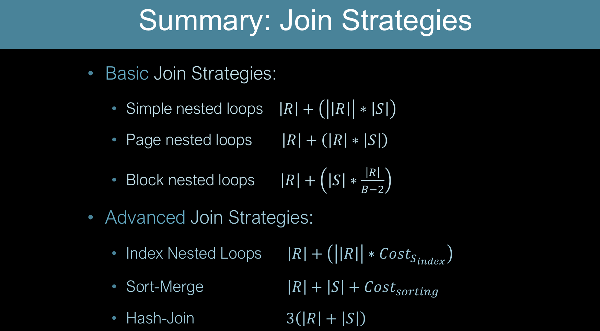

## Notation

- $\vert\vert R \vert\vert$: \# **tuples** in $R$
- $\vert R \vert$: \# **pages** in $R$
- metrics: \# of I/Os

## Simple Nested Loops

``` sh
for tuple r in R
    for tuple s in S
        if r match s add <r, s>
```

- cost: $\vert R \vert + \vert\vert R \vert\vert \cdot \vert S \vert$

## Page-Oriented Nested Loops (PNL)

``` sh
for page r_page in R
    for page s_page in S
        compare r in r_page with s in s_page
```

- cost: $\vert R \vert + \vert R \vert \cdot \vert S \vert$

## Block Nested Loops (BNL)

```sh
for block of B-2 pages of R
    for page s_page in S
        # in memory below
        for tuple r in block of B-2 R pages
            for tuple s in s_page
                if r match s add <r, s>
```

- $B$ buffer pages
  - $B-2$ pages for $R$ (outer) input
  - $1$ page for $S$ (inner) input
  - $1$ page for output

- cost: $\vert R \vert + \lceil \frac{\vert R \vert}{B-2} \rceil \cdot \vert S \vert$

- note: put smaller relation outside
  - time: $O(\vert\vert R \vert \vert \cdot \vert \vert S \vert \vert)$

## Index Nested Loops

```sh
for tuple r in R
    probe index on S
        for each matching tuple s add <r, s>
```

- leverage existing index on S
- cost: $\vert R \vert + \vert\vert R \vert\vert \cdot \text{cost of finding matching S tuples}$
  - cost of finding matching S tuples for each R tuple
    - index cost:
      - B+ tree: related to height (2-4)
      - Hash index: 1-2
    - record retrieval cost
      - clustered index: 1 I/O per R tuple
      - unclustered index: up to 1 I/O per S tuple

## Sort-Merge

```sh
sort R on join attribute
sort S on join attribute
merge
```

- cost:
  - sort: $2\vert R \vert (1+\lceil\log_{B-1}\lceil \frac{\vert R \vert}{2(B-2)}\rceil \rceil) + 2\vert S \vert (1+\lceil\log_{B-1}\lceil \frac{\vert S \vert}{2(B-2)}\rceil \rceil)$
  - merge:
    - average: $\vert R \vert + \vert S \vert$
    - worst: $\vert R \vert \cdot \vert S \vert$

## Grace Hash Join

- $B$ buffers
- steps:
  - **Partition**: $h_1$ hash both R and S, produce $k$ **partitions**
    - 1 input buffer page 
    - $k = B-1$ output buckets
    - **recursive partitioning**: $h_2$ for overflow partition ($\geq B-1$ pages)
  
  - **Probe**:
    - 1 input buffer
    - $B-2$ partition buffer 
    - 1 output buffer
    - $h_p$ to hash records in partition
      - reduce CPU costs

- cost:
  - Partiton: $2(\vert R\vert + \vert S \vert)$
  - Probe: $\vert R\vert + \vert S \vert$
    - read each partition of $R$ once
      - read corresponding partition of $S$ once
  - Total: $3(\vert R\vert + \vert S \vert)$

- note:
  - assume each $R$ partition fits in memory in probe phase

## Comparison

- GHJ vs. Sort-Merge Join
  - Sort-Merge Join optimize to $3(\vert R\vert + \vert S \vert)$:
    - larger relation $S$: $\vert S \vert \leq B^2$
    - result **sorted**
  - GHJ $3(\vert R\vert + \vert S \vert)$:
    - smaller relation $R$: $\vert R \vert \leq B^2$
    - partition of smaller relation fit in memory
    - Superior if size differ greatly
    - highly parallelizable
    - worse if partition skewed
- Multiple equality join (<sid, sname>)
  - BNL always work
  - Index Nested Loop:
    - index on <sid, sname> or sid or sname
    - usually more I/O than BNL
  - Sort/Hash
    - sort/hash on <sid, sname>
- Inequality join (R.name < S.name)
  - BNL still works
  - Index Nested Loop: usually worse than BNL
  - Sort/Hash not applicable


